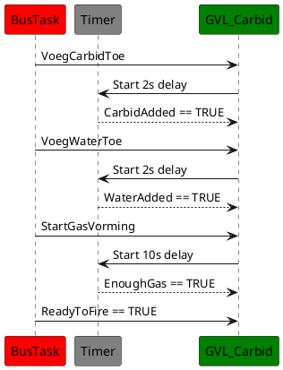

# Sequence Diagram Functie Aan Roepen

Hier wordt een sequentiediagram getoond waarin een functie-aanroep door een van de taken wordt geïllustreerd. Deze functie wordt opgeroepen om het knipperen van een lamp te regelen als signaal dat de bus klaar is om af te vuren. Het diagram toont de timing en volgorde van de functies en hoe deze bijdragen aan het procesbeheer.

