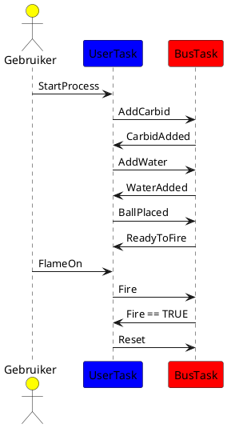

# Sequence Diagram Tussen Tasks

Dit hoofdstuk bevat een sequentiediagram waarin de communicatie tussen de UserTask en BusTask wordt weergegeven. Hierin wordt gedetailleerd beschreven hoe de twee taken via variabelen in de GVL samenwerken en informatie uitwisselen om de toestand van het proces correct te beheren.

