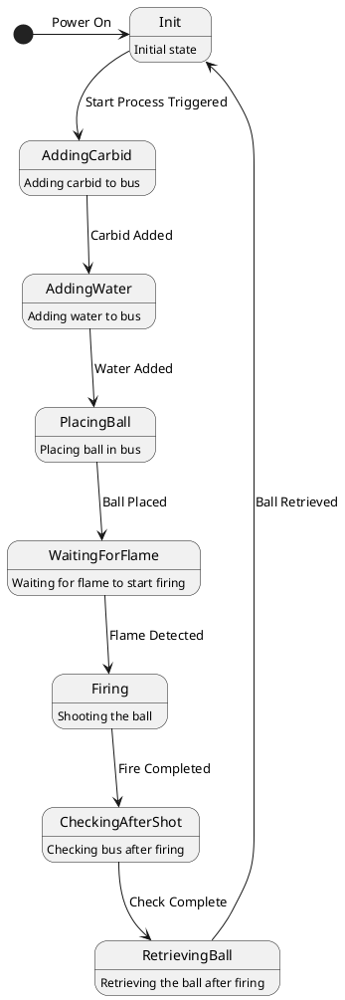
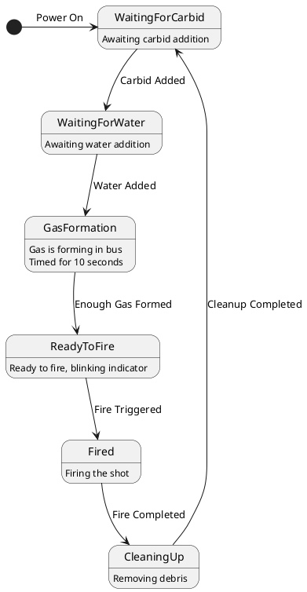

# State Diagrammen van de Taken
In dit hoofdstuk worden de statusdiagrammen van de afzonderlijke taken weergegeven. Hierin worden de stappen van elke taak in het proces van carbidschieten beschreven. De diagrammen helpen om de logische opbouw van de taken en de flow tussen verschillende processtappen te begrijpen.

# State Diagram UserTask

# State Diagram BusTask

